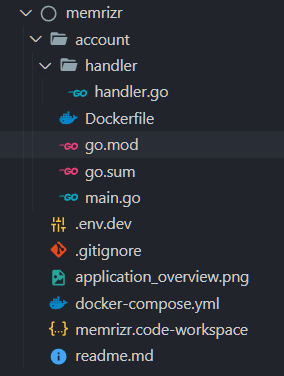

# 第二篇：在 Gin 中创建路由处理器

- 原文地址：https://dev.to/jacobsngoodwin/02-creating-route-handlers-in-gin-4f3j
- 作者：[Jacob Goodwin](https://dev.to/jacobsngoodwin)

在[上一篇](./01-setup-go-server-with-reload-in-docker)中，我们设置了一个名为 `account` 的Go应用程序，它在 Traefik 反向代理后自动重新加载，所有这些都运行在 Docker 开发环境中。

在本篇中，我们将使用gin设置http路由，它将允许我们创建用于管理用户帐户(`account`)的 API 端点。

本篇完成时，我们的文件目录结构应该如下所示：



我已经在[Github仓库](./https://github.com/JacobSNGoodwin/memrizr)中为每个教程创建了一个git分支。你可以在 ` branch for tutorial 01` 中使用这个分支来开始使用今天将使用的相同代码！要启动应用程序，请在顶层目录中运行 `docker-compose up`。

本篇视频地址：https://youtu.be/1eLdjW7tMr4

## 添加 Handler 包
首先，让我们在 `./account` 中创建一个名为 `handler` 的新文件夹。在这个文件夹中，创建一个名为 `handler.go` 的文件。这个文件将用于初始化 `handler` 包。项目中的约定是用包的名字来命名每个包的 “main” 文件。

在 ``handler.go` 文件中，我们将做：

1. 创建 `Handler` 结构体。这个结构将最终保存 `services` 属性。这些 `services` 包含实现应用程序核心功能的方法。
2. 创建 `Config` 结构体。这个结构将保存初始化 `handler` 包所需的所有值。
3. 一个 `NewHandler` 工厂函数。此函数用于初始化路由，并将从 `main` 包中调用。

我将在整个项目中使用这种带有配置的工厂方法，因为它有助于明确每个包需要哪些依赖项。虽然你会经常在其他的Go项目中看到这种情况，但它绝不是标准的。你可以直接初始化一个结构体。

我们将把在 `package main` 中创建的 gin路由器的引用传递到我们的 `handler` 包的 `Config` 配置中。有了这个引用，我们可以创建一个路由组，它允许我们为端点设置一个公共的 `base URL`(`/api/account`)。

在这个路由组中，我们将创建一个 get 路由，它将返回基本的JSON。这个GET路由是从我们最初放置在 `main.go` 中的路由复制粘贴过来的。

./account/handler/handler.go
```golang
package handler

import (
	"net/http"

	"github.com/gin-gonic/gin"
)

// Handler 保存处理程序运行所需的服务
type Handler struct{}

// Config 初始化 handler 包所需的配置数据
type Config struct {
	R *gin.Engine
}

// NewHandler 初始化需要注入的路由及初始数据
// 不返回，因为它直接处理 gin 引擎的引用
func NewHandler(c *Config) {
	// h := &Handler{}

	g := c.R.Group("/api/account")

	g.GET("/", func(c *gin.Context) {
		c.JSON(http.StatusOK, gin.H{
			"hello": "space peoples wewewe",
		})
	})
}
```

在测试这段代码之前，请确保从`package main`中删除GET路由处理程序，并用新创建的`package handler`的初始化替换它。注意，`NewHandler` 工厂只修改了gin路由器，不返回任何东西。

./account/main.go 
```golang
...

router := gin.Default()

handler.NewHandler(&handler.Config{
    R: router,
})

srv := &http.Server{
    Addr:    ":8080",
    Handler: router,
}

...

```

## 创建应用路由
在`handler.go`中，我们将添加 `NewHandler` 函数中的所有路由以及每个路由对应的处理程序方法。随着应用程序的增长，我们最终会将**路由处理函数**移动到单独的文件中。

可以看到，每个处理程序方法都返回一些简单的json，其中“hello”作为键，并返回一个值，告诉调用了哪个处理程序。

./account/handler/handler.go
```golang
...

// NewHandler 初始化需要注入的路由及初始数据
// 不返回，因为它直接处理 gin 引擎的引用
func NewHandler(c *Config) {
	h := &Handler{}

	g := c.R.Group("/api/account")

	g.GET("/me", h.Me)
	g.POST("signup", h.Signup)
	g.POST("signin", h.Signin)
	g.POST("signout", h.Signout)
	g.POST("tokens", h.Tokens)
	g.POST("/image", h.Image)
	g.DELETE("/image", h.DeleteImage)
	g.PUT("/details", h.Details)

	g.GET("/", func(c *gin.Context) {
		c.JSON(http.StatusOK, gin.H{
			"hello": "space peoples wewewe",
		})
	})
}

func (h *Handler) Me(c *gin.Context) {
	c.JSON(http.StatusOK, gin.H{
		"hello": "it's me",
	})
}

func (h *Handler) Signup(c *gin.Context) {
	c.JSON(http.StatusOK, gin.H{
		"hello": "it's me",
	})
}

func (h *Handler) Signin(c *gin.Context) {
	c.JSON(http.StatusOK, gin.H{
		"hello": "it's me",
	})
}

func (h *Handler) Signout(c *gin.Context) {
	c.JSON(http.StatusOK, gin.H{
		"hello": "it's me",
	})
}

// Tokens handler
func (h *Handler) Tokens(c *gin.Context) {
	c.JSON(http.StatusOK, gin.H{
		"hello": "it's tokens",
	})
}

// Image handler
func (h *Handler) Image(c *gin.Context) {
	c.JSON(http.StatusOK, gin.H{
		"hello": "it's image",
	})
}

// DeleteImage handler
func (h *Handler) DeleteImage(c *gin.Context) {
	c.JSON(http.StatusOK, gin.H{
		"hello": "it's deleteImage",
	})
}

// Details handler
func (h *Handler) Details(c *gin.Context) {
	c.JSON(http.StatusOK, gin.H{
		"hello": "it's details",
	})
}
```
随着`docker-compose up`的运行，你现在应该能够使用所选择的客户端向上述端点发出请求。我经常使用 Postman，但这里有一个从命令行使用 `curl` 的快速示例。
```
$ curl -X GET http://malcorp.test/api/account/me
{"hello":"it's me"}%
$ curl -X POST http://malcorp.test/api/account/signin
{"hello":"it's signin"}%
```

## 设置 base URL 环境变量
我们将把 base url `/api/account` 添加到一个环境变量中。我们现在就这样做，这样以后设置环境变量就变得轻而易举了!

要设置项目范围的环境变量，让我们在根目录 `memrizr` 中创建一个 `.env.dev` 文件。

.env.dev
```
ACCOUNT_API_URL=/api/account
```
我还建议创建一个 `.gitignore` 文件，并添加 `.env.dev` 作为一个条目，这样这个文件就会从你的 git 库中删除(最终我们会添加一些你不想在网上公开的数据项)。

然后，我们可以将该环境变量注入到 `docker-compose.yml` 文件中定义的 `account` 服务中，如下所示。现在，`account` 应用程序将可以访问添加到 `.env.dev` 中的任何环境变量！这只是在Docker或Docker Compose中创建环境变量的一种方法。

docker-compose.yml
```
account:
    ...
    ...
    env_file: .env.dev
```

最后，我们需要告诉应用程序在 `handler.go` 中使用这个环境变量。要实现这一点，请更新 Group 的参数名称，以获得我们刚刚设置的环境变量。

account/handler/handler.go
```
// g := c.R.Group("/api/account") // 此行替换下一行
g := c.R.Group(os.Getenv("ACCOUNT_API_URL"))
```
现在，您可以使用 `docker-compose up` 重新启动应用程序，并重新运行上面的 cURL 命令(或在您选择的客户端中)。

## 结尾
既然我们已经创建了路由，我们就有了一个从外部世界进入应用程序的入口点。这为我们讨论应用程序体系结构和构建应用程序层做好了准备。[下一篇](./03-application-architecture)
