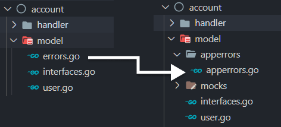
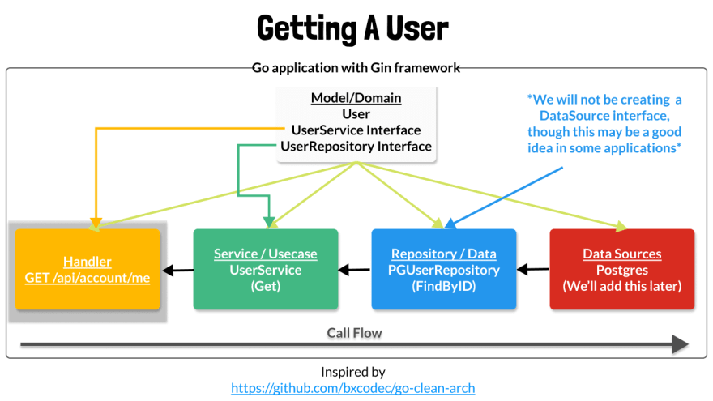
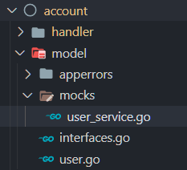

# 第四篇：使用 Testify Mock 测试 Gin http 处理器

- 原文地址：https://dev.to/jacobsngoodwin/04-testing-first-gin-http-handler-9m0
- 作者：[Jacob Goodwin](https://dev.to/jacobsngoodwin)

[上一篇](./03-application-architecture)我们讨论了应用的架构并在 `model` 包中创建了 `errors`,`interfaces` 以及 `user` 模型。本篇，我们将创建第一个处理程序 `Me`，用于访问当前登录用户的信息。此外，我们将通过模拟该处理程序所依赖的 `UserService` 来对该处理程序进行单元测试。

本篇视频地址：https://youtu.be/y21NluUbvXo

源码地址：[Github](https://github.com/JacobSNGoodwin/memrizr), 可切换到对应章节分支。

## 准备工作
在本篇开始之前，我们先做几个小改动。

**移动 `errors.go` 文件到 `model` 包 下新建的 `apperrors` 包中。**

`errors.go` 文件重命名成 `apperrors.go`,  然后将该文件移动到 `model` 包内部名为 `apperors` 的新文件夹中，如下图所示。



最后，确保更新文件顶部的包名。

account/model/apperrors/apperors.go
```golang
package apperrors

...
```

## 接口传递 Context 参数
现在， 需要将`go context` (上下文)中的上下文传递到我们的服务和存储库方法中。

需要做的就是将 `ctx conext.Context` 作为第一个参数添加到方法中，如下所示。将此上下文向下传递到调用链(`handler -> service -> repository -> data sources`)后，我们可以设置一个单一的截止日期，整个链必须在该截止日期之前完成。

```golang
package model

import (
	"context"

	"github.com/google/uuid"
)

// UserService 用户处理服务
type UserService interface {
	Get(ctx context.Context, uid uuid.UUID) (*User, error)
}

// UserRepository 用户存储服务
type UserRepository interface {
	FindByID(ctx context.Context, uid uuid.UUID) (*User, error)
}
```

## 重构 handler 包
是时候编写我们的第一个处理程序了，即下图中突出显示的 `me` 处理程序。



### 创建 me.go 文件
首先，我们将 `me` 处理程序方法从`handler.go`移到它自己的名为`me.go`的文件中。我们最终将以类似的方式将所有处理程序分解到单独的文件中。

./account/handler/me.go
```golang
package handler

import (
	"net/http"

	"github.com/gin-gonic/gin"
)

// Me 获取用户个人详情
func (h *Handler) Me(c *gin.Context) {
	c.JSON(http.StatusOK, gin.H{
		"hello": "it's me",
	})
}
```
### 注入 UserService 到 Handler 中
接下来，我们想要 `handler` 包能够使用 `UserService`，因此我们将把这个接口添加到我们的 `Handler` 结构体中，以及我们的 `NewHandler` 函数和配置，如下所示。我们的所有 `handler` 方法现在都可以访问我们在 `UserService` 接口上定义的任何方法！

./account/handler/handler.go
```golang
// Handler 保存处理程序运行所需的服务
type Handler struct {
	UserService model.UserService
}

// Config 初始化 handler 包所需的配置数据
type Config struct {
	R           *gin.Engine
	UserService model.UserService
}

// NewHandler 初始化需要注入的路由及初始数据
// 不返回，因为它直接处理 gin 引擎的引用
func NewHandler(c *Config) {
	h := &Handler{
		UserService: c.UserService,
	}

	...
}
```

## 更新 me.go 文件
我们将更新此文件以执行以下三项任务。

1. 检查以确保我们在请求上下文上(`*gin.Context`)设置了有效的用户。我们还没有创建一种方法来实现这一点，但我们稍后将通过创建中间件来实现这一点。
2. 在 `UserService` 上调用 `Get` 方法，我们需要将其注入 handler 包中。
3. 发送一个JSON响应，如果GET成功，则该响应将是一个用户，或者发送一个错误。

### 1. 有效用户的检查
首先，我们确保 `c*gin.Context` 上有一个名为 `User` 的键。正如前面提到的，我们将能够从中间件内部提取该用户，并在上下文中设置 `User` 值。

然后，我们检查以确保该键上有值。实际上，在这种情况下，我们的中间件已经返回了一个授权错误，但作为额外的预防措施，我们检查了这种情况(我认为这是“良好的实践”)。

最后，我们将用户转换为 `*mod.User`，并获得 UID，这是 `UserService.Get` 方法所需的参数。

./account/handler/me.go
```golang
package handler

import (
	"log"
	"memrizr/model"
	"memrizr/model/apperrors"

	"github.com/gin-gonic/gin"
)

// Me 获取用户个人详情
func (h *Handler) Me(c *gin.Context) {

	// 检查上下文 是否 存在 user
	user, exists := c.Get("user")

	if !exists {
		log.Printf("Unable to exteact user from request context for unkonw reason: %v\n", c)
		err := apperrors.NewInternal()
		c.JSON(err.Status(), gin.H{
			"error": err,
		})

		return
	}

	// 获取用户 id
	uid := user.(*model.User).UID

    ...
}

```

### 2. 调用 UserService.Get
这个很简单。我们还没有UserService的具体实现，所以我们很快就会学习如何模拟它的方法进行测试！

./account/handler/me.go
```golang

    ...

    // 获取用户 id
	uid := user.(*model.User).UID

	// 获取用户
	u, err := h.UserService.Get(c, uid)

    ...
```

### 3. 返回 json 响应
我们检查GET是否返回错误。如果是，我们将在我们的服务器上记录完整的错误。但是，我们只在JSON响应中向API使用者发送一个 `NotFound` 错误。

./account/handler/me.go
```golang

    ...

    // 获取用户 id
	uid := user.(*model.User).UID

	// 获取用户
	u, err := h.UserService.Get(c, uid)
	if err != nil {
		log.Printf("Unable to find user: %v\n%v", uid, err)
		e := apperrors.NewNotFound("user", uid.String())

		c.JSON(e.Status(), gin.H{
			"error": e,
		})
	}

	c.JSON(http.StatusOK, gin.H{
		"user": u,
	})
}
```

## 测试 me.go 文件

### Mock UserService Get 方法

在 `model` 目录下创建 `mocks`目录，并在其中创建 `user_service.go` 文件。如下所示：


我们将使用一个非常棒的测试包，名为 [testify](https://github.com/stretchr/testify) 创建我们的 Mocks。所以，要通过 `go get github.com/stretchr/testify` 来获取这个包。

在 `user_service.go` 文件中，我们将做如下：

1. 创建 `MockUserService` 结构体，并嵌套 `testify` 包中的 `mock.Mock`。它将提供对 `testify` 包内部的访问。
2. 添加一个实现 `UserService` 接口的 `Get` 方法，该接口目前只有一个 Get 方法。
3. 在 GET 内部，我们使用 `mock.Mock` 方法来记录调用此方法时发生的情况。在实际的测试中，我们可以创建一个 `MockUserService` 实例并编写代码(这得感谢有 `testify` 这个包)，该代码基本上表示当我们使用特定的上下文和 uid 调用 Get 时，为 `*Model.User` 和 `Error` 返回以下值。`m.Called` 方法使用特定的参数组合跟踪调用。然后，我们将方法的响应类型转换为 `*Model.User` 和 `Error`，并注意处理返回的 nil。创建此模拟后，我们可以确定是否在我们的测试中调用了此模拟用户服务。

> 注意 - 根据我的经验，我将手动创建我的测试，但有一个名为  [mockery](https://github.com/vektra/mockery) 的很好的代码生成工具可以为你构建这些mock。

./account/model/mocks/user_service.go
```golang
package mocks

import (
	"context"
	"memrizr/model"

	"github.com/google/uuid"
	"github.com/stretchr/testify/mock"
)

// MockUserService 模拟用户服务
type MockUserService struct {
	mock.Mock
}

func (m *MockUserService) Get(ctx context.Context, uid uuid.UUID) (*model.User, error) {
	ret := m.Called(ctx, uid)

	var r0 *model.User
	if ret.Get(0) != nil {
		r0 = ret.Get(0).(*model.User)
	}

	var r1 error

	if ret.Get(1) != nil {
		r1 = ret.Get(1).(error)
	}

	return r0, r1
}
```

### 创建 me_test.go 测试文件
首先，在 `handler` 包中创建一个 `me_est.go` 文件。在内部，我们将创建一个测试函数 `TestMe`，该函数设置 gin 在测试模式下运行，然后“运行”3个单独的用例，每个用例都定义在 `t.Run()` 方法中。

将要测试的用例如下：
1. 成功检索用户-应返回状态200和用户JSON。
2. 没有在上下文上提供用户-如果我们以某种方式通过中间件(尚未创建)到达这个处理程序，并且没有用户在上下文上，我们应该返回内部服务器错误。
3. 如果没有找到具有此id的用户(不太可能)，或者调用链中存在其他错误，我们将期望收到404, `Not Found` 响应。

完整代码如下，之后我们将总结测试

./account/handler/me_test.go
```golang
package handler

import (
	"encoding/json"
	"fmt"
	"net/http"
	"net/http/httptest"
	"testing"

	"github.com/stretchr/testify/mock"

	"memrizr/model/apperrors"
	"memrizr/model/mocks"

	"github.com/gin-gonic/gin"
	"github.com/stretchr/testify/assert"

	"github.com/google/uuid"

	"memrizr/model"
)

func TestMe(t *testing.T) {
	// Setup
	gin.SetMode(gin.TestMode)

	t.Run("Success", func(t *testing.T) {
		uid, _ := uuid.NewRandom()

		mockUserResp := &model.User{
			UID:   uid,
			Email: "bob@bob.com",
			Name:  "Bobby Bobson",
		}

		mockUserService := new(mocks.MockUserService)
		mockUserService.On("Get", mock.AnythingOfType("*gin.Context"), uid).Return(mockUserResp, nil)

		// a response recorder for getting written http response
		rr := httptest.NewRecorder()

		// use a middleware to set context for test
		// the only claims we care about in this test
		// is the UID
		router := gin.Default()
		router.Use(func(c *gin.Context) {
			c.Set("user", &model.User{
				UID: uid,
			},
			)
		})

		NewHandler(&Config{
			R:           router,
			UserService: mockUserService,
		})

		request, err := http.NewRequest(http.MethodGet, "/me", nil)
		assert.NoError(t, err)

		router.ServeHTTP(rr, request)

		respBody, err := json.Marshal(gin.H{
			"user": mockUserResp,
		})
		assert.NoError(t, err)

		assert.Equal(t, 200, rr.Code)
		assert.Equal(t, respBody, rr.Body.Bytes())
		mockUserService.AssertExpectations(t) // assert that UserService.Get was called
	})

	t.Run("NoContextUser", func(t *testing.T) {
		mockUserService := new(mocks.MockUserService)
		mockUserService.On("Get", mock.Anything, mock.Anything).Return(nil, nil)

		// a response recorder for getting written http response
		rr := httptest.NewRecorder()

		// do not append user to context
		router := gin.Default()
		NewHandler(&Config{
			R:           router,
			UserService: mockUserService,
		})

		request, err := http.NewRequest(http.MethodGet, "/me", nil)
		assert.NoError(t, err)

		router.ServeHTTP(rr, request)

		assert.Equal(t, 500, rr.Code)
		mockUserService.AssertNotCalled(t, "Get", mock.Anything)
	})

	t.Run("NotFound", func(t *testing.T) {
		uid, _ := uuid.NewRandom()
		mockUserService := new(mocks.MockUserService)
		mockUserService.On("Get", mock.Anything, uid).Return(nil, fmt.Errorf("Some error down call chain"))

		// a response recorder for getting written http response
		rr := httptest.NewRecorder()

		router := gin.Default()
		router.Use(func(c *gin.Context) {
			c.Set("user", &model.User{
				UID: uid,
			},
			)
		})

		NewHandler(&Config{
			R:           router,
			UserService: mockUserService,
		})

		request, err := http.NewRequest(http.MethodGet, "/me", nil)
		assert.NoError(t, err)

		router.ServeHTTP(rr, request)

		respErr := apperrors.NewNotFound("user", uid.String())

		respBody, err := json.Marshal(gin.H{
			"error": respErr,
		})
		assert.NoError(t, err)

		assert.Equal(t, respErr.Status(), rr.Code)
		assert.NotEqual(t, respBody, rr.Body.Bytes())
		mockUserService.AssertExpectations(t) // assert that UserService.Get was called
	})
}
```
### 测试成功
在成功的用例中，我们为 `UserService.Get` 创建了一个 `moockUserResp` 以返回。然后，我们创建最近创建的 `MockUserService` 的一个实例。然后，我们告诉这个 `moockUserService` 响应对Get方法的调用，该方法具有我们刚刚创建的 `moockUserResp` 的 uid。我们不需要 mock 关心第一个参数的细节，所以我们使用 `mock.AnythingOfType` 方法告诉它接受任何带有 `*gi.Context` 的调用。
```golang
mockUserService := new(mocks.MockUserService)
mockUserService.On("Get", mock.AnythingOfType("*gin.Context"), uid).Return(mockUserResp, nil)
```
然后我们添加一个 `httptest ResponseRecorder`，它允许我们检查我们收到的HTTP响应是否符合预期。

我们还创建了一个处理程序，其中注入了一个 `*gin.Engine` 和我们的 `moockUserService`。请注意，我们为该测试向路由器添加了一个中间件，如下所示。这就是我们如何在 `*gin.Context` 上设置用户，以模拟最终将在中间件中提取的实际用户。
```golang
router.Use(func(c *gin.Context) {
    c.Set("user", &model.User{
      UID: uid,
    },
    )
  })
```
接下来，创建一个 HTTP 请求，然后使用 `ServeHTTP` 方法将该请求发送到我们的路由器。然后，我们断言我们收到了一个带有预期 JSON 正文的 HTTP200 响应。最后，我们使用 `moockUserService.AssertExspections(T)` 检查是否在处理程序内部调用了  `moockUserService`。

### 测试 上下文无用户
此测试包括许多与前一次测试相同的代码。但是，我们不会使用 `router.Use(...)` 将用户添加到上下文中。就像在成功的用例中一样。

因此，我们需要一个 HTTP 500 状态代码。我们还预计不会调用 `moockUserService`，因为响应是在它有机会被调用之前发送的。

### 测试 未找到
这个测试与前两个类似，但在本例中，我们更改行为或 `mockUserService`，以便在调用 Get 方法时返回错误。

然后，我们断言返回正确的HTTP状态代码404，并返回一个包含错误的JSON响应。
```golang
mockUserService := new(mocks.MockUserService)
mockUserService.On("Get", mock.Anything, uid).Return(nil, fmt.Errorf("Some error down call chain"))
```
## 运行测试
在 `account` 项目文件夹内，运行 `go test -v ./handler` 来测试包。如果一切顺利，你应该看到输出，显示包含3个子测试的测试已经通过。确保尝试调整测试(例如，调整响应代码)以确保它们失败。

## 结尾
下一篇，我们将稍作休息，为用户服务编写代码，它将重复我们本篇谈到的许多原则。
